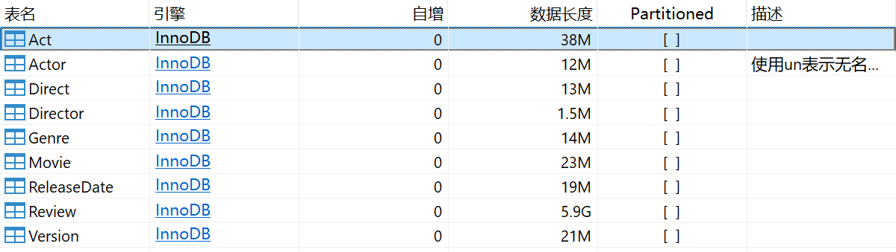

# 关系型数据建模

本项目以亚马逊电影评论数据集作为数据基础，使用`MySQL`作为关系型数据库，存储了全部的和电影相关的信息，以支持多种类的查询和统计，包括综合条件查询和演员导演之间的关系查询。

## 关系型存储逻辑模型（LDM设计）

### E-R图


### 星型模型图

## 关系型存储物理模型（PDM设计）

### DDL

```sql
CREATE DATABASE `dw2024`;

CREATE TABLE `Movie` (
  `movie_id` varchar(15) NOT NULL,
  `movie_title` varchar(511) CHARACTER SET utf8mb4 COLLATE utf8mb4_0900_ai_ci DEFAULT NULL,
  `imdb_score` float DEFAULT NULL,
  `review_num` int DEFAULT '0',
  PRIMARY KEY (`movie_id`)
) ENGINE=InnoDB DEFAULT CHARSET=utf8mb4 COLLATE=utf8mb4_0900_ai_ci;

CREATE TABLE `Review` (
  `review_uuid` binary(16) NOT NULL,
  `movie_id` varchar(15) CHARACTER SET utf8mb4 COLLATE utf8mb4_0900_ai_ci NOT NULL,
  `helpfulness` varchar(100) CHARACTER SET utf8mb4 COLLATE utf8mb4_0900_ai_ci DEFAULT NULL,
  `profile_name` varchar(100) DEFAULT NULL,
  `score` float DEFAULT NULL,
  `time` bigint DEFAULT NULL,
  `summary` text,
  `text` text,
  `user_id` varchar(100) DEFAULT NULL,
  PRIMARY KEY (`review_uuid`),
  KEY `Review_Movie_FK` (`movie_id`),
  CONSTRAINT `Review_Movie_FK` FOREIGN KEY (`movie_id`) REFERENCES `Movie` (`movie_id`) ON DELETE CASCADE ON UPDATE CASCADE
) ENGINE=InnoDB DEFAULT CHARSET=utf8mb4 COLLATE=utf8mb4_0900_ai_ci;

CREATE TABLE `Version` (
  `version_uuid` binary(16) NOT NULL,
  `movie_id` varchar(15) CHARACTER SET utf8mb4 COLLATE utf8mb4_0900_ai_ci NOT NULL,
  `edition` varchar(255) DEFAULT NULL,
  `language` varchar(255) DEFAULT NULL,
  PRIMARY KEY (`version_uuid`),
  KEY `Version_Movie_FK` (`movie_id`),
  CONSTRAINT `Version_Movie_FK` FOREIGN KEY (`movie_id`) REFERENCES `Movie` (`movie_id`) ON DELETE CASCADE ON UPDATE CASCADE
) ENGINE=InnoDB DEFAULT CHARSET=utf8mb4 COLLATE=utf8mb4_0900_ai_ci;

CREATE TABLE `ReleaseDate` (
  `date_uuid` binary(16) NOT NULL,
  `movie_id` varchar(15) CHARACTER SET utf8mb4 COLLATE utf8mb4_0900_ai_ci NOT NULL,
  `year` int DEFAULT NULL,
  `month` int DEFAULT NULL,
  `day` int DEFAULT NULL,
  `weekday` int DEFAULT NULL COMMENT '周一为0',
  PRIMARY KEY (`date_uuid`),
  KEY `RleaseDate_Movie_FK` (`movie_id`),
  CONSTRAINT `RleaseDate_Movie_FK` FOREIGN KEY (`movie_id`) REFERENCES `Movie` (`movie_id`) ON DELETE CASCADE ON UPDATE CASCADE
) ENGINE=InnoDB DEFAULT CHARSET=utf8mb4 COLLATE=utf8mb4_0900_ai_ci;

CREATE TABLE `Genre` (
  `genre_uuid` binary(16) NOT NULL COMMENT '使用UUID作为genre的ID',
  `movie_id` varchar(15) CHARACTER SET utf8mb4 COLLATE utf8mb4_0900_ai_ci NOT NULL COMMENT '电影ID，即原数据中的ASIN字段',
  `genre_name` varchar(1024) CHARACTER SET utf8mb4 COLLATE utf8mb4_0900_ai_ci NOT NULL,
  PRIMARY KEY (`genre_uuid`),
  KEY `Genre_Movie_FK` (`movie_id`),
  CONSTRAINT `Genre_Movie_FK` FOREIGN KEY (`movie_id`) REFERENCES `Movie` (`movie_id`) ON DELETE CASCADE ON UPDATE CASCADE
) ENGINE=InnoDB DEFAULT CHARSET=utf8mb4 COLLATE=utf8mb4_0900_ai_ci;

CREATE TABLE `Actor` (
  `actor_uuid` binary(16) NOT NULL,
  `actor_name` varchar(511) CHARACTER SET utf8mb4 COLLATE utf8mb4_0900_ai_ci DEFAULT NULL,
  PRIMARY KEY (`actor_uuid`)
) ENGINE=InnoDB DEFAULT CHARSET=utf8mb4 COLLATE=utf8mb4_0900_ai_ci COMMENT='使用un表示无名演员';

CREATE TABLE `Act` (
  `movie_id` varchar(15) NOT NULL,
  `actor_uuid` binary(16) NOT NULL,
  PRIMARY KEY (`actor_uuid`,`movie_id`),
  KEY `Act_Movie_FK` (`movie_id`),
  CONSTRAINT `Act_Actor_FK` FOREIGN KEY (`actor_uuid`) REFERENCES `Actor` (`actor_uuid`) ON DELETE CASCADE ON UPDATE CASCADE,
  CONSTRAINT `Act_Movie_FK` FOREIGN KEY (`movie_id`) REFERENCES `Movie` (`movie_id`) ON DELETE CASCADE ON UPDATE CASCADE
) ENGINE=InnoDB DEFAULT CHARSET=utf8mb4 COLLATE=utf8mb4_0900_ai_ci;

CREATE TABLE `Director` (
  `director_uuid` binary(16) NOT NULL,
  `director_name` varchar(511) CHARACTER SET utf8mb4 COLLATE utf8mb4_0900_ai_ci DEFAULT NULL,
  PRIMARY KEY (`director_uuid`)
) ENGINE=InnoDB DEFAULT CHARSET=utf8mb4 COLLATE=utf8mb4_0900_ai_ci;

CREATE TABLE `Direct` (
  `movie_id` varchar(15) NOT NULL,
  `director_uuid` binary(16) NOT NULL,
  PRIMARY KEY (`director_uuid`,`movie_id`),
  KEY `Direct_Movie_FK` (`movie_id`),
  CONSTRAINT `Direct_Director_FK` FOREIGN KEY (`director_uuid`) REFERENCES `Director` (`director_uuid`) ON DELETE CASCADE ON UPDATE CASCADE,
  CONSTRAINT `Direct_Movie_FK` FOREIGN KEY (`movie_id`) REFERENCES `Movie` (`movie_id`) ON DELETE CASCADE ON UPDATE CASCADE
) ENGINE=InnoDB DEFAULT CHARSET=utf8mb4 COLLATE=utf8mb4_0900_ai_ci;
```

### 日志表

设计一个如下的 `query_log` 表：

| 字段名               | 数据类型         | 说明                                 |
|----------------------|------------------|--------------------------------------|
| `log_id`             | INT (PK, AUTO_INCREMENT) | 日志ID，自增                        |
| `query_time`         | DATETIME         | 查询执行的时间                       |
| `query_text`         | TEXT             | 用户执行的查询语句                   |
| `query_params`       | TEXT             | 查询时的参数，以JSON格式存储         |
| `rows_returned`      | INT              | 返回的行数                           |
| `query_type`         | VARCHAR(50)      | 查询类型（如：统计，过滤等）         |
| `result_status`      | VARCHAR(20)      | 查询结果状态（成功、失败、超时等）  |
| `error_message`      | TEXT             | 错误信息（若查询失败时）             |

### 原始数据表

**1. 说明**

| 表名               | 存储内容                                        |
|--------------------|-------------------------------------------------|
| Movie              | 电影id，电影标题，电影评分，电影总评论数 |
| Actor 和 Act       | 演员的名字及参演的电影                           |
| Director 和 Direct | 导演的名字及导演的电影                           |
| Genre              | 电影的风格                                  |
| Release_date       | 电影上映时间相关的信息                       |
| Review             | 所有评论相关的信息                           |
| Version            | 电影相关的版本、语言、格式信息                |

**2. 数据库存储**


### Denormalization和PreAggregation表
