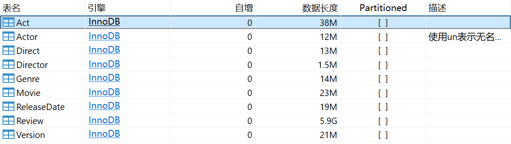
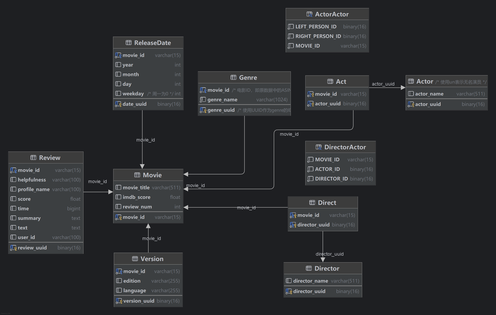
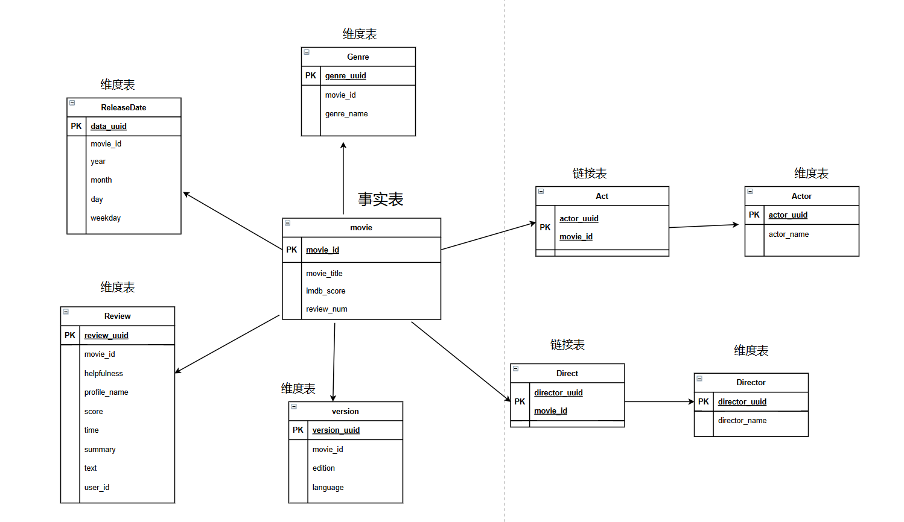
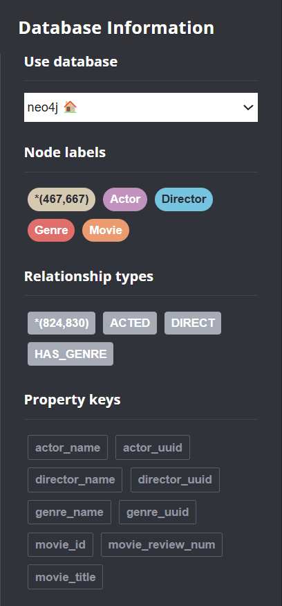

# 数据存储设计说明文件

- [数据存储设计说明文件](#数据存储设计说明文件)
  - [1. 整体存储模式](#1-整体存储模式)
    - [1.1 关系型存储](#11-关系型存储)
    - [1.2 分布式存储](#12-分布式存储)
    - [1.3 图数据存储](#13-图数据存储)
  - [2. 关系型存储模型](#2-关系型存储模型)
    - [2.1 关系型存储逻辑模型（LDM设计）](#21-关系型存储逻辑模型ldm设计)
      - [2.1.1 数据表结构](#211-数据表结构)
      - [2.1.2 E-R图](#212-e-r图)
      - [2.1.3 星型模型图](#213-星型模型图)
    - [2.2 关系型存储物理模型（PDM设计）](#22-关系型存储物理模型pdm设计)
      - [2.2.1 DDL](#221-ddl)
      - [2.2.2 日志表](#222-日志表)
      - [2.2.3 存储优化设计](#223-存储优化设计)
        - [a. 星型模型使用](#a-星型模型使用)
        - [b. 字段设置](#b-字段设置)
        - [c. 冗余存储](#c-冗余存储)
        - [d. 建立索引](#d-建立索引)
        - [e. 建立视图](#e-建立视图)
      - [2.2.4 Denormalization 和 PreAggregation 表设计](#224-denormalization-和-preaggregation-表设计)
        - [a. Denormalization 表](#a-denormalization-表)
        - [b. PreAggregation 表](#b-preaggregation-表)
  - [3. 分布式文件系统存储模型及优化](#3-分布式文件系统存储模型及优化)
  - [4. 图数据库存储模型及优化](#4-图数据库存储模型及优化)
    - [4.1 存储模型](#41-存储模型)
    - [4.2 cypher建表](#42-cypher建表)
    - [4.3 查询优化](#43-查询优化)
      - [4.3.1 存储字段选择](#431-存储字段选择)
      - [4.3.2 建立索引](#432-建立索引)
  - [5. 数据表的Test Case](#5-数据表的test-case)

<div STYLE="page-break-after: always;"></div>

## 1. 整体存储模式

### 1.1 关系型存储

### 1.2 分布式存储

### 1.3 图数据存储

本项目中，我们使用Neo4j进行图数据库的存储。在Neo4j中，节点和关系存储的数据如下：

**节点类型（Node Labels）：**

1. **Actor（演员）**
   - `actor_uuid`：演员的唯一标识符（UUID）
   - `actor_name`：演员的名字
2. **Director（导演）**
   - `director_uuid`: 导演的唯一标识符（UUID）
   - `director_name`: 导演的名字
3. **Movie（电影）**
   - `movie_id`: 电影的唯一标识符（ID）
   - `movie_title`: 电影的标题
   - `movie_review_num`: 电影的评论数量
4. **Genre（电影类型）**
   - `genre_uuid`：类型的唯一标识符（UUID）
   - `genre_name`：类型名称

**关系类型（Relationship Types）：**

1. **ACTED（参演）**
   - 连接演员(Actor)和电影(Movie)
   - 表示一个演员参演了某部电影

2. **DIRECT（执导）**
   - 连接导演(Director)和电影(Movie)
   - 表示一个导演执导了某部电影

3. **HAS_GENRE（拥有类型）**
   - 连接电影(Movie)和类型(Genre)
   - 表示一部电影属于某种类型或流派

## 2. 关系型存储模型

本项目以亚马逊电影评论数据集作为数据基础，使用`MySQL`作为关系型数据库，存储了全部的和电影相关的信息，以支持多种类的查询和统计，包括综合条件查询和演员导演之间的关系查询。

### 2.1 关系型存储逻辑模型（LDM设计）

#### 2.1.1 数据表结构

| 表名               | 存储内容                                        |
|--------------------|-------------------------------------------------|
| Movie              | 电影id，电影标题，电影评分，电影总评论数 |
| Actor 和 Act       | 演员的名字及参演的电影                           |
| Director 和 Direct | 导演的名字及导演的电影                           |
| Genre              | 电影的风格                                  |
| Release_date       | 电影上映时间相关的信息                       |
| Review             | 所有评论相关的信息                           |
| Version            | 电影相关的版本、语言、格式信息                |



#### 2.1.2 E-R图



#### 2.1.3 星型模型图



### 2.2 关系型存储物理模型（PDM设计）

#### 2.2.1 DDL

```sql
CREATE DATABASE `dw2024`;

CREATE TABLE `Movie` (
  `movie_id` varchar(15) NOT NULL,
  `movie_title` varchar(511) CHARACTER SET utf8mb4 COLLATE utf8mb4_0900_ai_ci DEFAULT NULL,
  `imdb_score` float DEFAULT NULL,
  `review_num` int DEFAULT '0',
  PRIMARY KEY (`movie_id`)
) ENGINE=InnoDB DEFAULT CHARSET=utf8mb4 COLLATE=utf8mb4_0900_ai_ci;

CREATE TABLE `Review` (
  `review_uuid` binary(16) NOT NULL,
  `movie_id` varchar(15) CHARACTER SET utf8mb4 COLLATE utf8mb4_0900_ai_ci NOT NULL,
  `helpfulness` varchar(100) CHARACTER SET utf8mb4 COLLATE utf8mb4_0900_ai_ci DEFAULT NULL,
  `profile_name` varchar(100) DEFAULT NULL,
  `score` float DEFAULT NULL,
  `time` bigint DEFAULT NULL,
  `summary` text,
  `text` text,
  `user_id` varchar(100) DEFAULT NULL,
  PRIMARY KEY (`review_uuid`),
  KEY `Review_Movie_FK` (`movie_id`),
  CONSTRAINT `Review_Movie_FK` FOREIGN KEY (`movie_id`) REFERENCES `Movie` (`movie_id`) ON DELETE CASCADE ON UPDATE CASCADE
) ENGINE=InnoDB DEFAULT CHARSET=utf8mb4 COLLATE=utf8mb4_0900_ai_ci;

CREATE TABLE `Version` (
  `version_uuid` binary(16) NOT NULL,
  `movie_id` varchar(15) CHARACTER SET utf8mb4 COLLATE utf8mb4_0900_ai_ci NOT NULL,
  `edition` varchar(255) DEFAULT NULL,
  `language` varchar(255) DEFAULT NULL,
  PRIMARY KEY (`version_uuid`),
  KEY `Version_Movie_FK` (`movie_id`),
  CONSTRAINT `Version_Movie_FK` FOREIGN KEY (`movie_id`) REFERENCES `Movie` (`movie_id`) ON DELETE CASCADE ON UPDATE CASCADE
) ENGINE=InnoDB DEFAULT CHARSET=utf8mb4 COLLATE=utf8mb4_0900_ai_ci;

CREATE TABLE `ReleaseDate` (
  `date_uuid` binary(16) NOT NULL,
  `movie_id` varchar(15) CHARACTER SET utf8mb4 COLLATE utf8mb4_0900_ai_ci NOT NULL,
  `year` int DEFAULT NULL,
  `month` int DEFAULT NULL,
  `day` int DEFAULT NULL,
  `weekday` int DEFAULT NULL COMMENT '周一为0',
  PRIMARY KEY (`date_uuid`),
  KEY `RleaseDate_Movie_FK` (`movie_id`),
  CONSTRAINT `RleaseDate_Movie_FK` FOREIGN KEY (`movie_id`) REFERENCES `Movie` (`movie_id`) ON DELETE CASCADE ON UPDATE CASCADE
) ENGINE=InnoDB DEFAULT CHARSET=utf8mb4 COLLATE=utf8mb4_0900_ai_ci;

CREATE TABLE `Genre` (
  `genre_uuid` binary(16) NOT NULL COMMENT '使用UUID作为genre的ID',
  `movie_id` varchar(15) CHARACTER SET utf8mb4 COLLATE utf8mb4_0900_ai_ci NOT NULL COMMENT '电影ID，即原数据中的ASIN字段',
  `genre_name` varchar(1024) CHARACTER SET utf8mb4 COLLATE utf8mb4_0900_ai_ci NOT NULL,
  PRIMARY KEY (`genre_uuid`),
  KEY `Genre_Movie_FK` (`movie_id`),
  CONSTRAINT `Genre_Movie_FK` FOREIGN KEY (`movie_id`) REFERENCES `Movie` (`movie_id`) ON DELETE CASCADE ON UPDATE CASCADE
) ENGINE=InnoDB DEFAULT CHARSET=utf8mb4 COLLATE=utf8mb4_0900_ai_ci;

CREATE TABLE `Actor` (
  `actor_uuid` binary(16) NOT NULL,
  `actor_name` varchar(511) CHARACTER SET utf8mb4 COLLATE utf8mb4_0900_ai_ci DEFAULT NULL,
  PRIMARY KEY (`actor_uuid`)
) ENGINE=InnoDB DEFAULT CHARSET=utf8mb4 COLLATE=utf8mb4_0900_ai_ci COMMENT='使用un表示无名演员';

CREATE TABLE `Act` (
  `movie_id` varchar(15) NOT NULL,
  `actor_uuid` binary(16) NOT NULL,
  PRIMARY KEY (`actor_uuid`,`movie_id`),
  KEY `Act_Movie_FK` (`movie_id`),
  CONSTRAINT `Act_Actor_FK` FOREIGN KEY (`actor_uuid`) REFERENCES `Actor` (`actor_uuid`) ON DELETE CASCADE ON UPDATE CASCADE,
  CONSTRAINT `Act_Movie_FK` FOREIGN KEY (`movie_id`) REFERENCES `Movie` (`movie_id`) ON DELETE CASCADE ON UPDATE CASCADE
) ENGINE=InnoDB DEFAULT CHARSET=utf8mb4 COLLATE=utf8mb4_0900_ai_ci;

CREATE TABLE `Director` (
  `director_uuid` binary(16) NOT NULL,
  `director_name` varchar(511) CHARACTER SET utf8mb4 COLLATE utf8mb4_0900_ai_ci DEFAULT NULL,
  PRIMARY KEY (`director_uuid`)
) ENGINE=InnoDB DEFAULT CHARSET=utf8mb4 COLLATE=utf8mb4_0900_ai_ci;

CREATE TABLE `Direct` (
  `movie_id` varchar(15) NOT NULL,
  `director_uuid` binary(16) NOT NULL,
  PRIMARY KEY (`director_uuid`,`movie_id`),
  KEY `Direct_Movie_FK` (`movie_id`),
  CONSTRAINT `Direct_Director_FK` FOREIGN KEY (`director_uuid`) REFERENCES `Director` (`director_uuid`) ON DELETE CASCADE ON UPDATE CASCADE,
  CONSTRAINT `Direct_Movie_FK` FOREIGN KEY (`movie_id`) REFERENCES `Movie` (`movie_id`) ON DELETE CASCADE ON UPDATE CASCADE
) ENGINE=InnoDB DEFAULT CHARSET=utf8mb4 COLLATE=utf8mb4_0900_ai_ci;
```

#### 2.2.2 日志表

设计一个如下的 `query_log` 表：

| 字段名               | 数据类型         | 说明                                 |
|----------------------|------------------|--------------------------------------|
| `log_id`             | INT (PK, AUTO_INCREMENT) | 日志ID，自增                        |
| `query_time`         | DATETIME         | 查询执行的时间                       |
| `query_text`         | TEXT             | 用户执行的查询语句                   |
| `query_params`       | TEXT             | 查询时的参数，以JSON格式存储         |
| `rows_returned`      | INT              | 返回的行数                           |
| `query_type`         | VARCHAR(50)      | 查询类型（如：统计，过滤等）         |
| `result_status`      | VARCHAR(20)      | 查询结果状态（成功、失败、超时等）  |
| `error_message`      | TEXT             | 错误信息（若查询失败时）             |

#### 2.2.3 存储优化设计

##### a. 星型模型使用

本项目采用星型模型结构，对数据存储有一定的冗余。首先建立一个 `movie` 表，然后将 `movie` 的属性拆分到相关的维度表中，以优化查询性能。

##### b. 字段设置

- **时间戳字段**
  在 `review` 表中，`time` 字段记录了评论的时间戳。我们采用 `bigint` 类型而非 `datetime` 类型存储时间戳，原因如下：
  - **跨平台一致性**：`bigint` 类型可以确保跨不同数据库和编程语言的一致性。
  - **存储空间优化**：相对于 `datetime` 类型，`bigint` 类型通常需要较少的存储空间，这对于行数巨大的表（如 `review` 表）而言，可以节省存储空间。
  - **比较效率**：在某些情况下，使用整数进行日期和时间的比较可能比 `datetime` 类型更高效，因为整数的比较操作通常更快。
- **评分字段**
  在 `movie` 表中，`movie_score` 等评分相关的数据使用 `float` 类型存储。
  - **存储空间节省**：`float` 类型的存储空间通常小于 `double` 类型。
  - **精度需求满足**：电影评分通常不需要较高的精度，因此 `float` 类型足够使用。
- **日期字段**
  在 `release_date` 表中，使用 `varchar` 类型存储 `year`、`month`、`day` 和 `weekday` 字段。
  - **非标准格式支持**：允许直接存储非标准日期格式或混合格式数据。
  - **兼容性增强**：避免不同应用程序间日期格式解析的兼容性问题。
  - **索引支持**：为这些字段建立索引以加速查询。

##### c. 冗余存储

- **相关评论数**
  在电影表中冗余存储相关评论数量，这样在查询最受欢迎的演员组合时，可以避免与评论表进行 `JOIN` 操作，从而节省时间。
- **时间表优化**
  将时间单独抽象成一张表，并以不同数据格式存储时间戳。查询时可直接匹配，避免额外处理数据，节省查询时间。

##### d. 建立索引

除了主键和外键等数据库自动建立的索引外，对常用查询字段建立单列索引和组合索引，以加速查询操作。

- **单列索引**
  - 演员表：为 `演员姓名` 建立单列索引。
  - 导演表：为 `导演姓名` 建立单列索引。
  - 风格表：为 `电影风格` 建立单列索引。
  - 时间表：为 `年份` 建立单列索引。
  - 版本表：为 `电影语言` 和 `电影格式` 分别建立单列索引。
- **组合索引**
  - 时间表：
    - 年和月建立组合索引。
    - 年和季度建立组合索引。
    - 工作日建立单列索引。

##### e. 建立视图

- **演员合作视图**
  建立演员与演员之间合作的视图，字段包括：
  - 演员1的 `ID`
  - 演员2的 `ID`
  - 合作电影的 `ID`
- **演员与导演合作视图**
  建立演员与导演之间合作的视图，字段包括：
  - 演员的 `ID`
  - 导演的 `ID`
  - 合作电影的 `ID`

#### 2.2.4 Denormalization 和 PreAggregation 表设计

为了提升查询性能，尤其是针对大数据量的电影信息数据库，需要提前进行一些数据的`Denormalization`和`PreAggregation`。

##### a. Denormalization 表

下表将原始数据表中的数据进行预合并，避免查询时频繁的JOIN操作。

**表名：`movie_actor_director_denormalized`**

| 字段名               | 数据类型      | 说明                         |
| -------------------- | ------------- | ---------------------------- |
| `movie_id`           | INT (PK)      | 电影ID（唯一标识）           |
| `movie_name`         | VARCHAR(255)  | 电影名称                     |
| `release_year`       | INT           | 电影发行年份                 |
| `release_month`      | INT           | 电影发行月份                 |
| `release_quarter`    | INT           | 电影发行季度                 |
| `genre`              | VARCHAR(100)  | 电影类别                     |
| `director_id`        | INT           | 导演ID                       |
| `director_name`      | VARCHAR(255)  | 导演姓名                     |
| `actor_ids`          | TEXT          | 主演演员ID列表，以逗号分隔   |
| `actor_names`        | TEXT          | 主演演员姓名列表，以逗号分隔 |
| `rating`             | DECIMAL(3, 1) | 电影评分                     |
| `user_ratings_count` | INT           | 评分人数                     |

**说明：**
- `actor_ids`和`actor_names`字段存储主演演员的ID和姓名，以逗号分隔。此表通过Denormalization减少了每次查询时对演员信息的联结。
- 电影的分类信息、导演和演员信息都存储在一个表中，减少了查询时的联结。
- `release_year`, `release_month`, `release_quarter`字段分别存储了电影的年份、月份和季度，方便按时间维度进行查询。

##### b. PreAggregation 表

设计如下表，提前计算一些常见的聚合指标，比如按照年、月、季度、导演、演员等维度进行汇总。

**表名：`movie_yearly_statistics`**

| 字段名            | 数据类型      | 说明                   |
| ----------------- | ------------- | ---------------------- |
| `release_year`    | INT (PK)      | 电影发行年份           |
| `total_movies`    | INT           | 该年发布的电影总数     |
| `average_rating`  | DECIMAL(3, 1) | 该年电影的平均评分     |
| `total_actors`    | INT           | 该年参演电影的演员总数 |
| `total_directors` | INT           | 该年参与的导演总数     |
| `total_genres`    | INT           | 该年电影涉及的总类别数 |

**表名：`movie_monthly_statistics`**

| 字段名           | 数据类型      | 说明               |
| ---------------- | ------------- | ------------------ |
| `release_year`   | INT (PK)      | 电影发行年份       |
| `release_month`  | INT (PK)      | 电影发行月份       |
| `total_movies`   | INT           | 该月发布的电影总数 |
| `average_rating` | DECIMAL(3, 1) | 该月电影的平均评分 |

- `movie_yearly_statistics`和`movie_monthly_statistics`表帮助按年、月快速进行统计和查询，例如查询某一年或某个月的电影总数、平均评分等。

**表名：`movie_actor_director_collaborations`**

| 字段名           | 数据类型     | 说明                 |
| ---------------- | ------------ | -------------------- |
| `actor_id`       | INT (PK)     | 演员ID               |
| `actor_name`     | VARCHAR(255) | 演员姓名             |
| `director_id`    | INT (PK)     | 导演ID               |
| `director_name`  | VARCHAR(255) | 导演姓名             |
| `collaborations` | INT          | 演员与导演合作的次数 |

- `movie_actor_director_collaborations`表提前计算了演员和导演之间的合作次数，便于快速查询哪些演员和导演经常合作。

**表名：`movie_genre_statistics`**

| 字段名           | 数据类型      | 说明                 |
| ---------------- | ------------- | -------------------- |
| `genre`          | VARCHAR(100)  | 电影类别             |
| `total_movies`   | INT           | 该类别电影的总数     |
| `average_rating` | DECIMAL(3, 1) | 该类别电影的平均评分 |

- `movie_genre_statistics`表提前汇总了各电影类别的电影总数和平均评分，帮助快速查询某个类别的电影统计数据。

## 3. 分布式文件系统存储模型及优化

## 4. 图数据库存储模型及优化

### 4.1 存储模型



### 4.2 cypher建表

```Cypher
// 创建节点
// 1.在Actor节点上创建约束
CREATE CONSTRAINT FOR (a:Actor) REQUIRE a.actor_uuid IS UNIQUE;
// 导入Actor数据
LOAD CSV WITH HEADERS FROM 'file:///Actor.csv' AS row
MERGE (a:Actor {actor_uuid: row.actor_uuid})
ON CREATE SET a.actor_name = row.actor_name;

// 2.在Director节点上创建约束
CREATE CONSTRAINT FOR (d:Director) REQUIRE d.director_uuid IS UNIQUE; 
//导入Director数据
LOAD CSV WITH HEADERS FROM 'file:///Director.csv' AS row
CREATE(:Director {director_uuid: row.director_uuid, director_name:row.director_name});

// 3.在Movie节点上创建约束
CREATE CONSTRAINT FOR (m:Movie) REQUIRE m.movie_id IS UNIQUE;
//导入Movie数据
LOAD CSV WITH HEADERS FROM 'file:///Movie.csv'AS row
CREATE(:Movie {movie_id: row.movie_id, movie_title: row.movie_title, movie_review_num: row.review_num});

// 4.在Genre节点上创建约束
CREATE CONSTRAINT FOR (g:Genre) REQUIRE g.genre_uuid IS UNIQUE;
//导入Genre数据
LOAD CSV WITH HEADERS FROM 'file:///Genre.csv' AS row
CREATE(:Genre {genre_uuid: row.genre_uuid, genre_name: row.genre_name});

// 建立关系
// 1.导入演员参演关系
LOAD CSV WITH HEADERS FROM 'file:///Act.csv' AS row
MATCH (a:Actor {actor_uuid: row.actor_uuid})
WITH a, row
MATCH (m:Movie {movie_id: row.movie_id})
CREATE (a)-[:ACTED]->(m);

// 2.导入导演执导关系
LOAD CSV WITH HEADERS FROM 'file:///Direct.csv' AS row
MATCH (a:Director {director_uuid:row.director_uuid})
WITH a, row
MATCH (m:Movie {movie_id: row.movie_id})
CREATE (a)-[:DIRECT]->(m);

// 3.导入电影风格关系
LOAD CSV WITH HEADERS FROM 'file:///Genre.csv' AS row
MATCH (m:Movie {movie_id: row.movie_id})
WITH m, row
MATCH (g:Genre {genre_uuid: row.genre_uuid})
MERGE (m)-[:HAS_GENRE]->(g);
```

### 4.3 查询优化

#### 4.3.1 存储字段选择

- 在数据库中只存储**4类节点**（演员、导演、电影、电影类型）以及**3种关系**（导演与电影间的执导关系、演员与电影之间的参演关系、电影类型的拥有关系），便于查询时快速进行计算。
- 在数据库中电影节点中存储电影相关的评论数，便于统计。

#### 4.3.2 建立索引

- 对查询时4类节点中将会用到的字段建立索引，分别是演员名、演员名、电影名、电影风格

## 5. 数据表的Test Case
